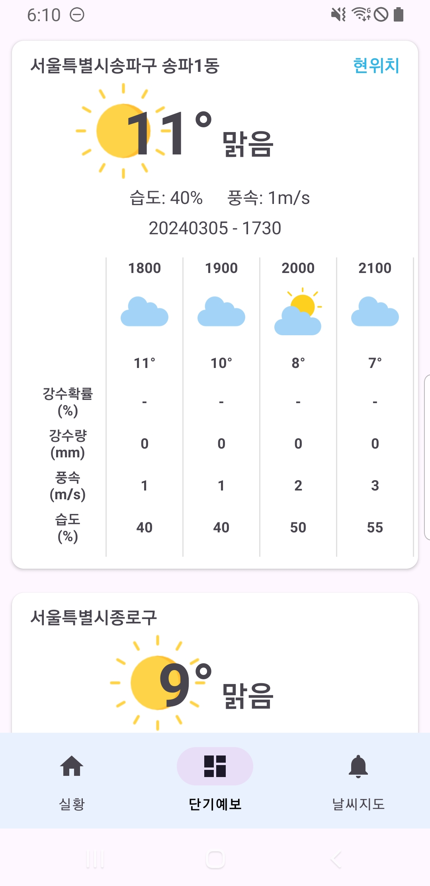

# Weather
공공 데이터  날씨 API 를 이용한 샘플 프로젝트  
Compose, Viewmodel, Flow 를 이용 MVVM 구조의 반응형 프로그램으로 구현

### 라이브러리
[1.0.0]
+ Compose

[0.1.0]
+ Hit
+ Retrofit
+ Room
+ Data Binding
+ Data Store - proto
+ Google Map

### 화면 구성
+ 실황 

  현재 위치와 사용자 설정 위치의 날씨 실황 데이터 표시
  + 주소 검색

    검색을 통한 위치 데이터 표시
    
+ 단기 예보

  현재 위치와 사용자 설정 위치의 날씨 단기 예보 데이터 표시

+ 날씨 지도

  Google Map 의 Marker 를 이용 지도상의 실황 날씨 이미지 표시

     

### API
+ 공공데이터 포탈 (기상청 단기 예보)
+ https://www.data.go.kr/data/15084084/openapi.do

### 빌드
 Google Map API, 공공데이터 포탈 날씨 API 요청 필요

+ local.properties
  + GOOGLE_MAPS_API_KEY 입력 필요
  + WEATHER_API_KEY 입력 필요

+ build.gradle.kts (:app)
  + Google Map 사용 시 signingConfigs keystore 정보 입력 필요

### 설치 파일
app-debug.apk 사용
